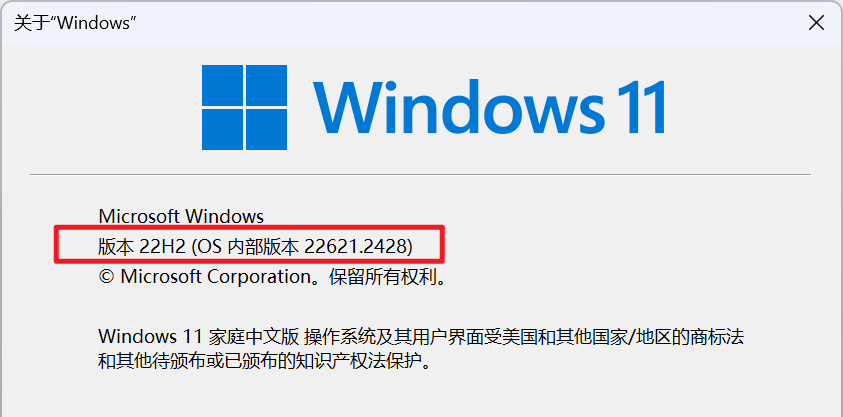
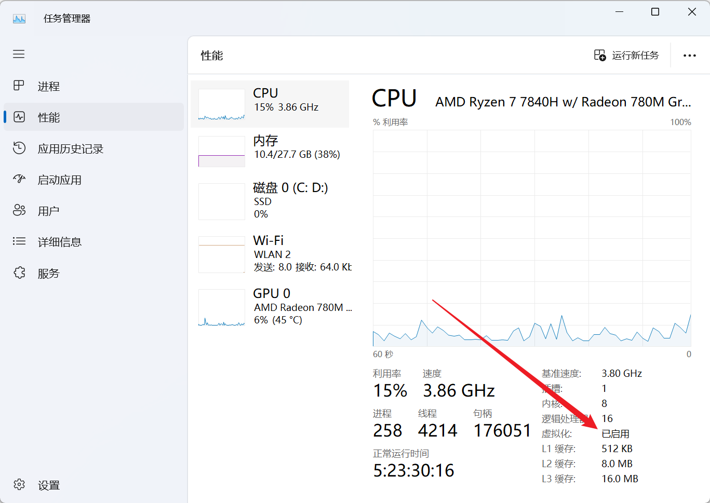
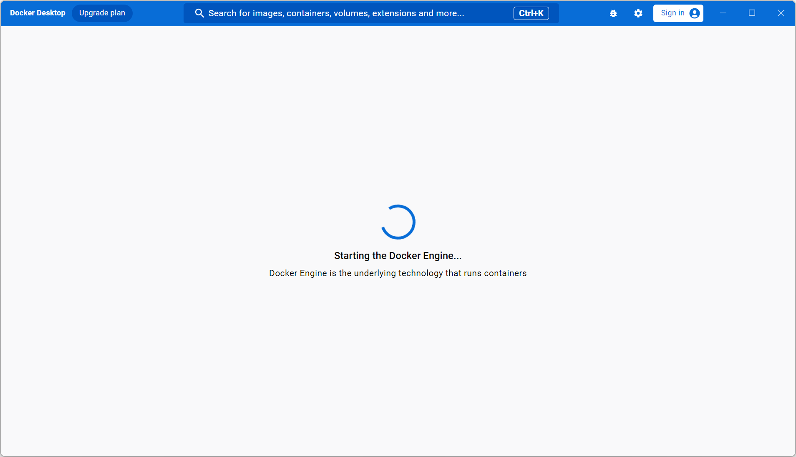
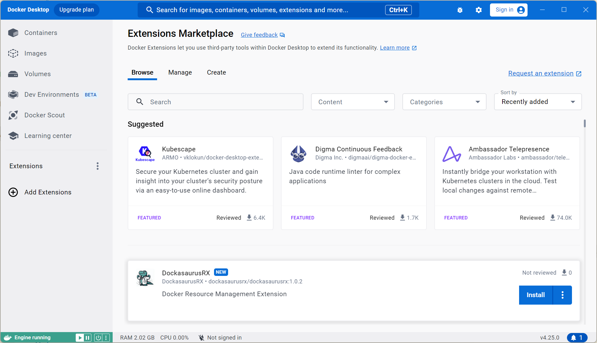
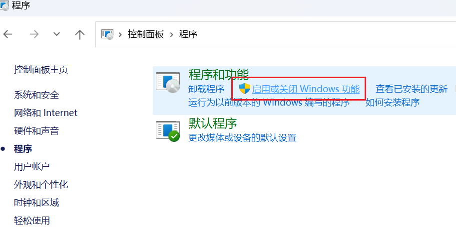
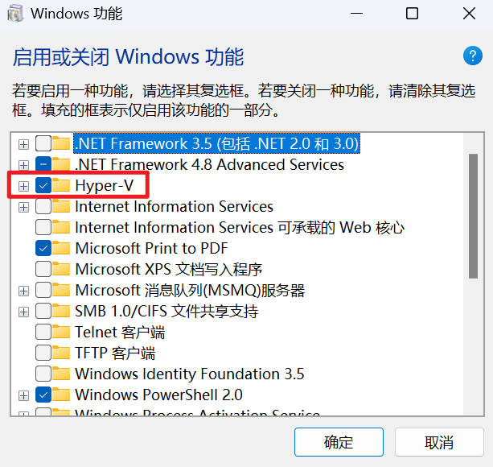
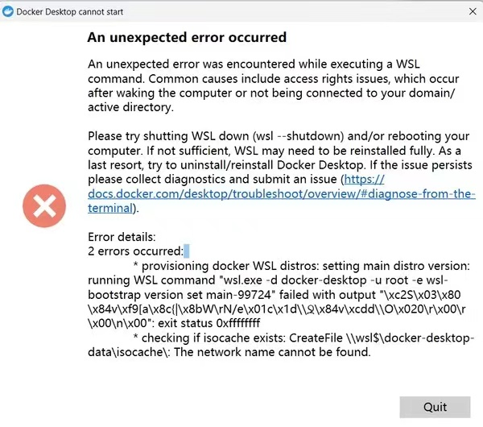

# Docker for windows安装

> Docker for windows 下载地址：https://www.docker.com/products/docker-desktop/

## 一、开始前

安装Docker需要虚拟化支持，在不安装虚拟机(VBox)的前提下有两种选择：
1. WSL2：启用Windows的Linux子系统。（推荐）
2. Hyper-V：专业版Windows自带的虚拟机。

有人说安装docker需要预先准备一个Linux发行版子系统，实际上docker for windows目前的版本(4.25.0)在安装后的启动过程中会自行为windows安装wsl.localhost，名为docker-desktop，无需额外安装。

开始安装之前需要做的准备：
1. 检查Windows系统版本（x86/x64 系统）
    <center></center>

   - 满足Windows版本 1903 或更高，内部版本为 18362.1049 或更高，可以选择旧版安装方式。
   - 满足Windows内部版本 19041 或更高、 Windows 11，可以选择简化版安装命令，缺点是会安装一个Ubuntu Linux发行版。


2. 检查虚拟化是否开启
   打开任务管理器，性能 —— “虚拟化” 已启用。
    <center></center>
若未启用，可参考文档 [在Windows 11电脑上启用虚拟化](https://support.microsoft.com/zh-cn/windows/%E5%9C%A8windows-11%E7%94%B5%E8%84%91%E4%B8%8A%E5%90%AF%E7%94%A8%E8%99%9A%E6%8B%9F%E5%8C%96-c5578302-6e43-4b4b-a449-8ced115f58e1) 。

## 二、WSL2 旧版安装方法

### 1.启用适用于 Linux 的 Windows 子系统

```cmd
dism.exe /online /enable-feature /featurename:Microsoft-Windows-Subsystem-Linux /all /norestart
```

### 2.启用虚拟机功能

以管理员身份打开 cmd 并运行：
```cmd
dism.exe /online /enable-feature /featurename:VirtualMachinePlatform /all /norestart
```
重启计算机。

### 3.将WSL2设置为默认版本

```cmd
wsl --set-default-version 2
```
完成后，没有必要按照官网指导去Microsoft Store安装发行版，我们只需要Docker自带的Linux就够了。

### 4.安装Docker

打开Docker for Windows安装包，任意方式安装。首次启动时，会卡在加载页面一段时间，这是在安装Linux子系统。
    <center></center>

等待加载完毕，出现这个页面即可正常使用。
    <center></center>

## 三、WSL2 简化安装方法

### 1.安装WSL2
打开 PowerShell（或 Windows 命令提示符）并输入：
```cmd
wsl --install
```
> --install 命令执行以下操作：
> 1. 启用可选的 WSL 和虚拟机平台组件
> 2. 下载并安装最新 Linux 内核
> 3. 将 WSL 2 设置为默认值
> 4. 下载并安装 Ubuntu Linux 发行版（可能需要重新启动）

### 2.安装Docker

[方法同上](#_4-安装docker)


## 四、使用 Hyper-V 而非 WSL
1. 检查Hyper-v是否启用，打开控制面板。
<center></center>
<center></center>

:::details 对于非  <u>Windows专业版</u> ，没有Hyper-v功能的解决方案
1. 新建txt输入以下命令，保存并修改后缀为.bat，右键以管理员身份运行。
```cmd
pushd "%~dp0"
dir /b %SystemRoot%\servicing\Packages\*Hyper-V*.mum >hyper-v.txt
for /f %%i in ('findstr /i . hyper-v.txt 2^>nul') do dism /online /norestart /add-package:"%SystemRoot%\servicing\Packages\%%i"
del hyper-v.txt
Dism /online /enable-feature /featurename:Microsoft-Hyper-V-All /LimitAccess /ALL
```
:::

## 五、常见报错

<center></center>
<center>来源网络</center>
<!--  -->

> <center>An unexpected error occurred</center>An unexpected error was encountered while executing a WSLcommand. Common causes include access rights issues, which occurafter waking the computer or not being connected to your domain/active directory.

原因：WSL没有安装成功,或默认版本没有切换到WSL2。


## 六、参考链接

[旧版 WSL 的手动安装步骤 - support.microsoft.com](https://learn.microsoft.com/zh-cn/windows/wsl/install-manual)

[WSL 开发环境最佳安装实践 - support.microsoft.com](https://learn.microsoft.com/zh-cn/windows/wsl/setup/environment)

[排查适用于 Linux 的 Windows 子系统问题 - support.microsoft.com](https://learn.microsoft.com/zh-cn/windows/wsl/troubleshooting)