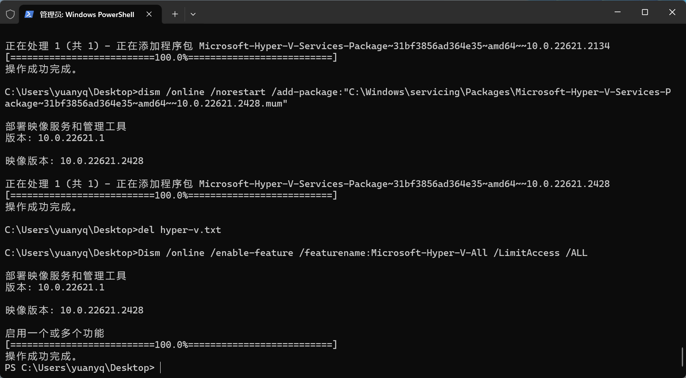

# Windows docker环境安装记录

windows11 22H2 家庭中文版

docker下载地址：https://www.docker.com/products/docker-desktop/

## 安装运行，出现报错

<center></center>
<center>来源网络</center>
<!--  -->

> <center>An unexpected error occurred</center>&nbsp&nbsp&nbsp&nbspAn unexpected error was encountered while executing a WSLcommand. Common causes include access rights issues, which occurafter waking the computer or not being connected to your domain/active directory.

## 处理方法
### 方法1
- cmd执行`netsh winsock reset`，完成后重启docker，或重启电脑。
### 方法2
1. 检查Hyper-v是否启用，打开控制面板。
<center></center>
<center></center>

:::details 对于  <u>Windows家庭版</u>  没有Hyper-v功能的解决方案
1. 新建txt输入以下命令，保存并修改后缀为.bat，右键以管理员身份运行。
```cmd
pushd "%~dp0"
dir /b %SystemRoot%\servicing\Packages\*Hyper-V*.mum >hyper-v.txt
for /f %%i in ('findstr /i . hyper-v.txt 2^>nul') do dism /online /norestart /add-package:"%SystemRoot%\servicing\Packages\%%i"
del hyper-v.txt
Dism /online /enable-feature /featurename:Microsoft-Hyper-V-All /LimitAccess /ALL
```
2. 安装结束，若有重启提示，按Y键重启。
<center></center>
:::

2. 启用Windows10子系统功能。
```cmd
dism.exe /online /enable-feature /featurename:Microsoft-Windows-Subsystem-Linux /all /norestart
```
3. 启用虚拟机平台功能。
```cmd
dism.exe /online /enable-feature /featurename:VirtualMachinePlatform /all /norestart
```
4. 重启电脑。
5. 下载 Linux 内核更新包（适用于 x64 计算机的 WSL2 Linux 内核更新包）

    将 WSL 2 设置为默认版本，powershell输入如下命令：
```cmd
wsl --set-default-version 2
```
6. 重新打开docker。

## 参考链接

[Windows操作系统下安装Docker指南](https://blog.csdn.net/m0_67713667/article/details/128563601)

[Docker Desktop Unexpected WSL error](https://devpress.csdn.net/cloud-native/650d3506e0aa6850f5a2457a.html)

[Window安装docker desktop打开报错问题](https://www.cnblogs.com/macq/p/17219768.html)